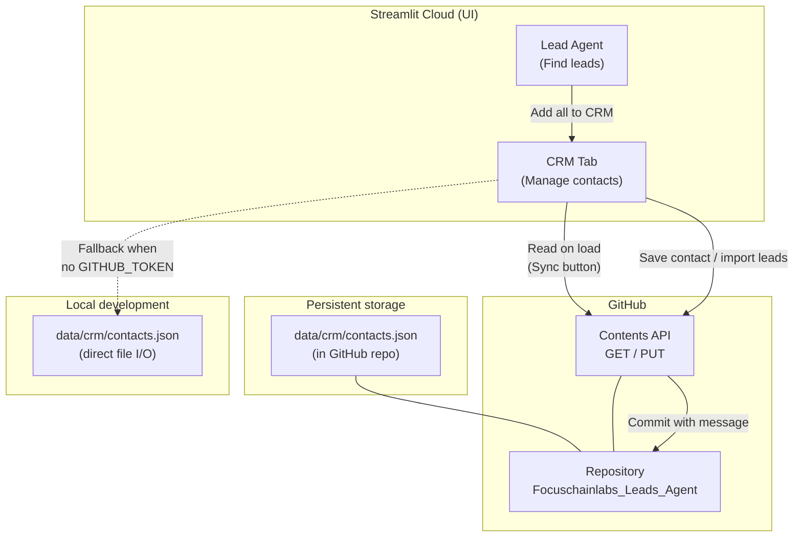

# CRM Architecture

FocusChain LeadGen stores CRM contacts in **your GitHub repository**, not on Streamlit Cloud's ephemeral filesystem. This lets data survive app reboots, redeploys, and free-tier restarts.

## How it works



## Data flow

| Action | What happens |
|--------|----------------|
| **App boots on Streamlit Cloud** | CRM loads `data/crm/contacts.json` from GitHub API (latest version, no redeploy needed) |
| **User edits a contact** | JSON updated → committed to GitHub via API → persists in repo |
| **User imports agent leads** | Leads merged (deduped by email/phone/name+company) → committed to GitHub |
| **App reboots / crashes** | Next load reads same file from GitHub — contacts are still there |
| **Local dev (no token)** | Reads/writes `data/crm/contacts.json` directly on disk |

## Why GitHub (not GitHub Pages)?

| Option | Verdict |
|--------|---------|
| **GitHub repo + Contents API** | ✅ Used — interactive CRM needs read/write; repo is the database |
| **Streamlit Cloud filesystem** | ❌ Ephemeral — wiped on every reboot |
| **GitHub Pages** | ❌ Static hosting only — cannot save CRM edits from the UI |

## Setup (Streamlit Cloud)

1. Create a **GitHub Personal Access Token** (classic) with `repo` scope  
   → [github.com/settings/tokens](https://github.com/settings/tokens)

2. In **Streamlit Cloud → App → Settings → Secrets**, add:

```toml
GITHUB_TOKEN = "ghp_xxxxxxxx"
GITHUB_REPO = "savinpadencherry/Focuschainlabs_Leads_Agent"
GITHUB_BRANCH = "main"
CRM_DATA_PATH = "data/crm/contacts.json"
```

3. Redeploy the app. The CRM tab will show **Synced via GitHub**.

4. Commit `data/crm/contacts.json` to the repo (empty `contacts: []` is fine).

## Contact fields

Each CRM record includes:

- **Identity:** name, company, title, email, phone, LinkedIn, website  
- **Pipeline:** status (new → contacted → qualified → meeting → proposal → nurture → won/lost; custom stages supported)  
- **Sales context:** client/campaign, score, signal, pain point, opening line, call strategy  
- **Follow-up:** notes, tags, last contacted, next follow-up, reach channel  
- **Provenance:** source, agent run id, created/updated timestamps  

## Files

| File | Role |
|------|------|
| `data/crm/contacts.json` | CRM database (committed to GitHub) |
| `utils/crm_store.py` | GitHub API + local file persistence |
| `utils/crm_models.py` | Schema, dedupe, lead → contact mapping |
| `crm_ui.py` | CRM Streamlit UI (expandable contacts, filters, KPIs) |
| `streamlit_app.py` | Navigation + "Add all to CRM" on results |

## Conflict handling

If two users edit CRM at the same time, GitHub returns HTTP 409. The app shows a warning — click **Sync** to reload the latest version and retry your edit.
