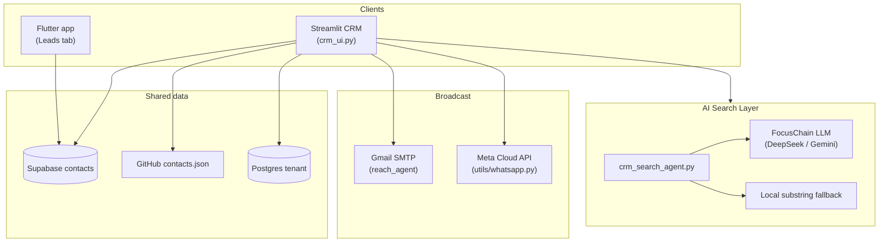
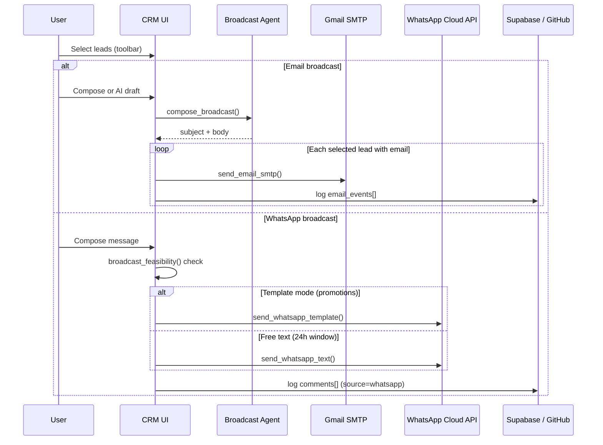
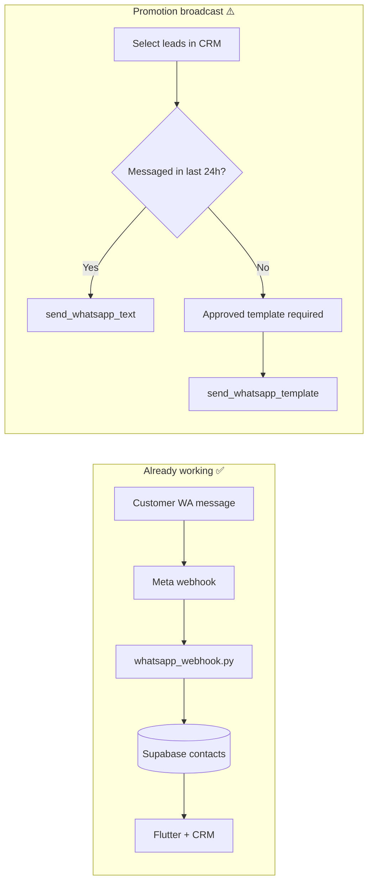
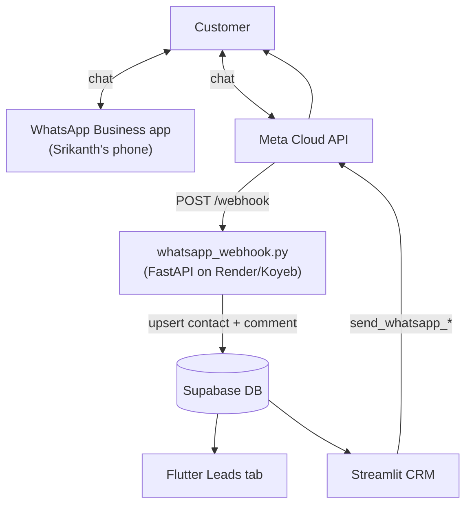

# Leads Search, Multi-Select Broadcast & WhatsApp Feasibility

This guide covers the new CRM + mobile capabilities: **AI search**, **quick status updates**, **multi-select email/WhatsApp broadcast**, and what you need for WhatsApp promotions.

---

## What was added

| Feature | CRM (Streamlit) | Flutter mobile |
|---------|-----------------|----------------|
| Search bar | ✅ AI + substring | ✅ See `integrations/flutter/` |
| Quick status update from search | ✅ e.g. "move Jewel to contacted" | ✅ Advance stage from search match |
| Multi-select | ✅ Existing + extended | ✅ Long-press / select mode |
| Bulk stage update | ✅ | ✅ |
| Email broadcast | ✅ Gmail SMTP | ⏳ Use CRM web for now |
| WhatsApp broadcast | ✅ With feasibility guardrails | ⏳ Use CRM web for now |

---

## Architecture



---

## AI search (CRM web)

The search bar accepts plain text **or** natural language:

| Example query | What happens |
|---------------|--------------|
| `jewel spacia` | Fast local match on name/company |
| `qualified leads due this week` | LLM parses → stage + follow-up filters |
| `move Radhakrishna to contacted` | Finds lead + shows **Advance status** button |
| `advance Jewel to next status` | Moves to next pipeline stage |

Pipeline order: `new → contacted → qualified → proposal → won/lost`

**Requires:** `DEEPSEEK_API_KEY` or `GEMINI_API_KEY` for AI parsing. Without a key, substring + local heuristics still work.

---

## Multi-select broadcast flow



### Email broadcast setup

Add to Streamlit secrets / `.env`:

```env
SMTP_FROM_EMAIL=you@gmail.com
SMTP_APP_PASSWORD=xxxx xxxx xxxx xxxx
```

Use `{{name}}` and `{{company}}` in the body for light personalisation.

---

## WhatsApp feasibility (read this before promotions)

You already have **inbound** WhatsApp → webhook → Supabase/CRM working (see `whatsapp_webhook.py`, `docs/WHATSAPP_COEXISTENCE.md`).

### What works today

| Scenario | API | Cost / rules |
|----------|-----|--------------|
| Customer messages you first | Inbound webhook → CRM | Free tier: 1,000 conversations/mo |
| Reply within 24 hours | `send_whatsapp_text()` | Free inside service window |
| Srikanth replies from Business app | Coexistence echo (skipped in parser) | See coexistence runbook |
| CRM bulk send to recent WA leads | `send_whatsapp_text()` | Only if they messaged you in last 24h |

### What does NOT work like WhatsApp Business "Broadcast lists"

Meta Cloud API **cannot** blast arbitrary promotional text to cold leads. For that you need:

1. **Approved message template** in Meta Business Manager → WhatsApp Manager → Message templates
2. **User opt-in** (marketing consent)
3. **`send_whatsapp_template()`** with template name + parameters



### Your action checklist for WhatsApp promotions

- [ ] **Confirm coexistence** is linked if Srikanth uses the Business app (`docs/WHATSAPP_COEXISTENCE.md`)
- [ ] **Create a marketing template** in Meta (e.g. `promo_offer` with `{{1}}` body param)
- [ ] **Set env vars** on webhook + Streamlit:
  ```env
  WHATSAPP_ACCESS_TOKEN=...
  WHATSAPP_PHONE_NUMBER_ID=...
  ```
- [ ] **In CRM**: Select leads → WhatsApp popover → check "Use approved template" → enter template name
- [ ] **Collect opt-in** on website/forms ("I agree to WhatsApp updates") — required for compliance
- [ ] **Rate limit**: Meta throttles bulk sends; CRM sends sequentially (add delay in production if >50)

### Coexistence + your existing hook



No change needed to the inbound hook for search/broadcast — only add outbound credentials to Streamlit for sends from CRM.

---

## Flutter mobile integration

Updated reference files live in:

```
integrations/flutter/
  lib/features/leads/view/leads_page.dart
  lib/core/services/crm/leads_crm_service.dart
  lib/core/services/crm/supabase_crm_service.dart
```

Copy these into [Focuschainlabs_mobile](https://github.com/savinpadencherry/Focuschainlabs_mobile).

### Mobile features

- Search bar filters the list client-side (no scroll through hundreds)
- Tap a lead → bottom sheet to **advance stage** or pick a stage
- Long-press / select mode for multi-select (stage update on selection)

---

## Files changed (this repo)

| File | Purpose |
|------|---------|
| `agent/crm_search_agent.py` | AI + local search parsing |
| `agent/broadcast_agent.py` | AI broadcast copy |
| `crm_ui.py` | Search UI, quick status, bulk actions |
| `utils/whatsapp.py` | Template send + feasibility helper |
| `utils/crm_models.py` | `next_pipeline_status()` |
