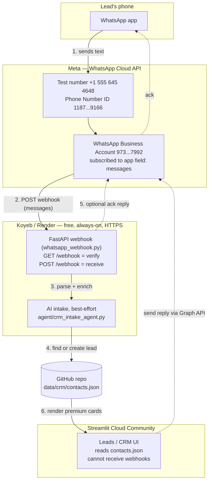

# WhatsApp → CRM — Demo Setup (free, ~20 min)

Goal: a real WhatsApp message lands as a lead in the CRM, viewable in the
Streamlit app. This is the **test-number** path — no business verification,
no money, no production phone number. Production hardening is a later step.

> ⚠️ **Rotate your token first.** If a `WHATSAPP_ACCESS_TOKEN` was ever pasted
> into chat/email/a file, treat it as burned: Meta → WhatsApp → API Setup →
> **Generate new token**. The dashboard "temporary" token also expires in ~24h —
> for anything that must keep working overnight, create a **System User token**
> (below). Never commit a token; it only ever lives in host env vars / secrets.

---

## Architecture



**Why two services?** Streamlit Cloud Community runs a script top-to-bottom on
each interaction — it has no custom HTTP route and cannot return Meta's webhook
responses. So the webhook is a tiny separate FastAPI app
(`whatsapp_webhook.py`); Streamlit stays the UI and just reads the same CRM
file. They share the GitHub-backed `data/crm/contacts.json`.

---

## The single most important thing to understand

The payload you saw is a **status receipt**, not a message:

```json
"statuses": [ { "status": "read", "recipient_id": "919764543918", ... } ]
```

Meta sends `statuses` (sent / delivered / read of *outbound* messages) on the
**same `messages` field** as real inbound texts. Our webhook intentionally
**ignores statuses** and only stores inbound `text` messages — so a status
delivery correctly creates **no lead**. That is not a bug.

To create a lead you must trigger an **inbound** message: from your personal
WhatsApp, send a text **to** the test number (+1 555 645 4648). The logs now
print `delivery received, stored nothing — 1 status update(s)` vs.
`created: 9197... (NN chars)` so you can tell the two apart.

---

## Step 1 — Host the webhook (free, no credit card)

Streamlit can't do it (no custom POST route), so host the tiny webhook
elsewhere. All three below are free with **no credit card**. (Koyeb used to be
the pick but now forces payment setup — skip it.)

| Option | Sleeps? | Setup | Best for |
|---|---|---|---|
| **Hugging Face Spaces** (recommended) | only after 48h idle | paste 2 files | reliable demo, stays warm |
| Render (Blueprint) | after ~15 min idle | pure clicks (`render.yaml` in repo) | fewest steps |
| ngrok + run locally | while your machine is on | one command | you have a laptop |

Why HF over Render: Meta's "Verify and Save" times out fast, and a *sleeping*
Render service often fails that first verification. HF Spaces don't sleep on a
15-min timer, so verification just works.

### Option A — Hugging Face Spaces (uses `deploy/huggingface/`)
Your repo is public, so the Space pulls the code itself — no file juggling.
1. https://huggingface.co/new-space → name it, **SDK = Docker**, **Blank**,
   hardware **CPU basic (free)**.
2. **Files → Add file → Create new file** → name it `Dockerfile`; paste the
   contents of `deploy/huggingface/Dockerfile` from this repo. Commit.
3. Open the Space's `README.md`, replace it with `deploy/huggingface/README.md`
   (the `app_port: 7860` header matters). Commit.
4. **Settings → Variables and secrets** → add the secrets from Step 2.
5. The Space rebuilds; your URL is `https://<user>-<space>.hf.space`.
6. Sanity check: open `https://<user>-<space>.hf.space/healthz` →
   `{"ok": true, "whatsapp_configured": true}`.

### Option B — Render (uses `render.yaml` + `Dockerfile.webhook`)
1. https://render.com → sign up with GitHub (no card).
2. **New + → Blueprint** → pick this repo → Render reads `render.yaml`.
3. Fill the secret values when prompted (Step 2) → **Apply**.
4. URL is `https://focuschain-whatsapp-webhook.onrender.com`.
5. It sleeps after 15 min: open `…/healthz` to wake it *before* you verify in
   Meta, and add a free https://uptimerobot.com monitor pinging `/healthz`
   every 5 min to keep it warm during the demo.

### Option C — ngrok (laptop)
```bash
pip install -r requirements-webhook.txt
export WHATSAPP_ACCESS_TOKEN=... WHATSAPP_PHONE_NUMBER_ID=1187318104459166 \
       WHATSAPP_VERIFY_TOKEN=focuschain_demo_123 \
       GITHUB_TOKEN=ghp_... GITHUB_REPO=savinpadencherry/Focuschainlabs_Leads_Agent
uvicorn whatsapp_webhook:app --port 8080
ngrok http 8080      # use the https URL it prints
```

---

## Step 2 — Environment variables (on the host, never in git)

Minimum to capture leads:

```bash
WHATSAPP_ACCESS_TOKEN=EAAxxxxxxxx          # the ROTATED token
WHATSAPP_PHONE_NUMBER_ID=1187318104459166  # your test number's Phone Number ID
WHATSAPP_VERIFY_TOKEN=focuschain_demo_123  # any string YOU invent; reused in Step 3
GITHUB_TOKEN=ghp_xxxx                       # classic PAT, "repo" scope
GITHUB_REPO=savinpadencherry/Focuschainlabs_Leads_Agent
GITHUB_BRANCH=main                          # branch the CRM JSON lives on
```

Optional niceties:

```bash
WHATSAPP_SEND_ACK=true     # auto-reply "Got it — noted in our CRM…"
DEEPSEEK_API_KEY=sk-...    # or GEMINI_API_KEY — lets AI fill name/company/notes.
                           # Omit and leads still save (AI step is best-effort).
```

---

## Step 3 — Point Meta at the webhook

Meta → your app → **WhatsApp → Configuration** (the "Configure Webhooks" panel
in your screenshot):

1. **Callback URL:** `https://<your-host>/webhook`
2. **Verify token:** the exact `WHATSAPP_VERIFY_TOKEN` from Step 2.
3. **Verify and save.** (Meta GETs `/webhook?hub.challenge=…`; the service echoes
   it back. A 403 here = token mismatch; a timeout = host asleep/wrong URL.)
4. **Subscribe the field:** in the same panel, **Manage → tick `messages`.**

### ⚠️ The "test works but real messages don't" trap (do this!)
Since late 2025, adding a phone number no longer auto-links the WABA to your
app. If verification passes but inbound texts never arrive, your WABA isn't
subscribed. Confirm / fix via API (use your rotated token):

```bash
# Check — should list your app, not an empty data array:
curl "https://graph.facebook.com/v21.0/973966145447992/subscribed_apps" \
  -H "Authorization: Bearer $WHATSAPP_ACCESS_TOKEN"

# Subscribe if empty:
curl -X POST "https://graph.facebook.com/v21.0/973966145447992/subscribed_apps" \
  -H "Authorization: Bearer $WHATSAPP_ACCESS_TOKEN"
```
(`973966145447992` is your WhatsApp Business Account ID.)

### Allowed recipients + app mode
- **API Setup → "To" field → Manage phone number list:** add your personal
  WhatsApp (e.g. `+91 97645 43918`) and confirm the code. Test numbers can only
  exchange messages with numbers on this list.
- **App mode (top of dashboard):** the orange banner warns that *unpublished*
  apps may not receive real data. If inbound still doesn't arrive after the
  subscription fix, flip the app to **Live**. That only needs a **Privacy Policy
  URL** in *Settings → Basic* — it does **not** require business verification.

---

## Step 4 — Test

1. From your personal WhatsApp, send **"Hi, this is Aditya from MMA Design"** to
   **+1 (555) 645-4648**.
2. Watch host logs:
   - `created: 919764543918 (NN chars)` ✅ lead created
   - `stored nothing — 1 status update(s)` ℹ️ that was a receipt, send a real text
3. Open the Streamlit app → the lead appears (and the new premium card shows the
   inbound message in its thread). The CRM commit also shows up in GitHub.

Quick offline checks:
```bash
curl https://<host>/healthz
curl "https://<host>/webhook?hub.mode=subscribe&hub.verify_token=focuschain_demo_123&hub.challenge=ping"
# -> prints: ping
```

---

## What's NOT needed for the demo
- ❌ Business verification (Step 3 docs/bank statements screen) — production only.
- ❌ Your own production phone number — the test number is enough.
- ❌ Streamlit changes to "receive" WhatsApp — it only reads the CRM file.

## For production later (not now)
- Permanent **System User** token (Business Settings → System Users → generate,
  perms `whatsapp_business_messaging` + `whatsapp_business_management`).
- Register your own phone number + complete business verification.
- Verify `X-Hub-Signature-256` on the webhook (anti-spoofing) using the app secret.
- Higher messaging tier; consider Postgres backend for volume.
